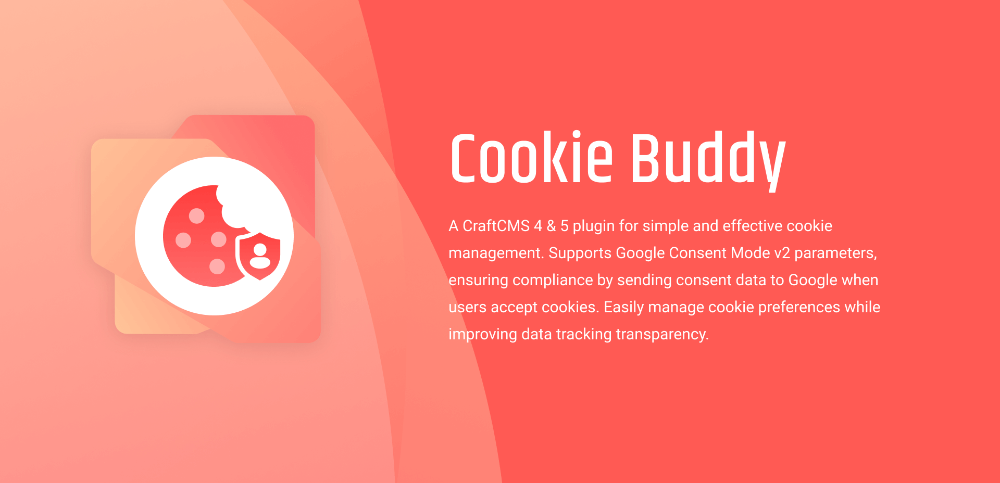

# Cookie Buddy for CraftCMS



A CraftCMS 4 & 5 plugin for simple and effective cookie management. Supports Google Consent Mode v2 parameters, ensuring compliance by sending consent data to Google when users accept cookies. Easily manage cookie preferences while improving data tracking transparency.

## Features

- **Cookie Consent Popup** Easily enable a cookie consent popup for your CraftCMS 4 or 5 site. Inform users about cookie usage and allow them to make informed choices.

- **Google Consent Mode v2 Support** Automatically send consent signals to Google Analytics based on user preferences—crucial for privacy compliance and accurate data tracking.

- **Fully Customizable UI** Customize the popup title, description, layout (box or banner), position (e.g. bottom-right), footer links, and button styling to match your brand.

- **Granular Preferences Control** Provide individual descriptions for required, performance, and targeting cookies. Help users understand what each cookie category does.

- **User-Friendly Setup** Configure everything through a clean, intuitive settings panel inside the CraftCMS control panel. No coding required.


## Requirements

- **Craft CMS 4.0.0/5.0.0 or later**
- **PHP 8.0.2 or later**
- **Google Analytics integration in place (custom code or through other plugin)**

## Installation

You can install this plugin from the Plugin Store or with Composer.

#### From the Plugin Store

1. Go to the Plugin Store in your project’s Control Panel.
2. Search for Cookie Buddy”.
3. Click on the “Install” button in the plugin's modal window.

#### With Composer

Open your terminal and run the following commands:

```bash
# Navigate to your project directory
cd /path/to/my-project.test

# Require the plugin via Composer
composer require convergine/craft-cookie-buddy

# Install the plugin via Craft CLI
./craft plugin/install craft-cookie-buddy
```

## Configuration

After installation, navigate to the plugin settings and enable the popup/google options as well as configure the look & feel of the consent window.

If enabling passing consent information to Google - make sure that your site already has Google Analytics integration code in place, as our plugin does not 

## Roadmap

- **Design Customization Options**: Ability to further modify the look and feel of the consent popups.

- **Translations Suport**: Enable option to translate the popups contents to all languages enabled in Craft instance.

- **Multi-Site Controls**: Choose which multi-site to display the consent on.

- **Design Themes**: Add pre-made design themes for popups. 

## Support

For any issues or questions, you can reach us by email at [info@convergine.com](mailto:info@convergine.com) or by opening an issue on [GitHub](https://github.com/convergine/craft-cookie-buddy).

## Credits

Portions of the cookie consent functionality are based on the work of [Orest Bida](https://github.com/orestbida/cookieconsent), © 2020–present, and used under the MIT License.
